<div align="center">

# Dockyard

A themeable desktop dock for Windows. Drop apps on it, they become tiles.<br />
Hover and they magnify, and the row spreads apart to make room.

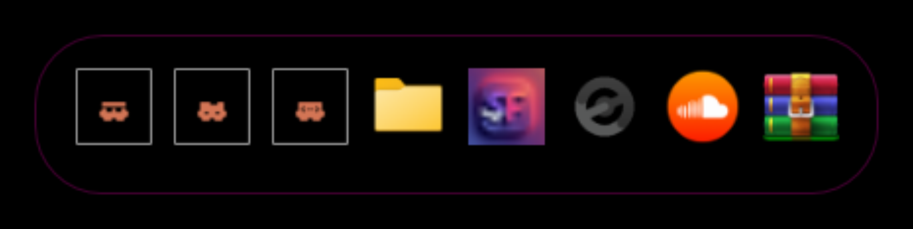

**[Download the latest release &rarr;](../../releases/latest)**

</div>

---
## What it does

- **Drop an app on it.** `.exe`, Start-menu shortcut, folder, document, or a URL dragged straight
  from the address bar. Shortcuts are resolved to their real target, arguments and working
  directory, and it picks up the shortcut's own custom icon if it has one.
- **Sharp icons at any size.** Pulled from the shell's 256px jumbo cache, so they hold up when
  scaled instead of going crunchy like classic desktop icons.
- **Magnification that behaves like a dock.** A gaussian falloff scales the icons near your cursor,
  and the row re-spreads around them so grown neighbours slide out of each other's way rather than
  overlapping.
- **Sits below your windows.** Off the taskbar, out of Alt+Tab, and clicking a tile won't steal
  focus or raise the dock over what you're doing.
- **Remembers where it is,** across a reboot and a launch-at-login.
- **Nine themes**, or build your own with a full colour editor.

---

## Themes

<table>
  <tr>
    <td align="center">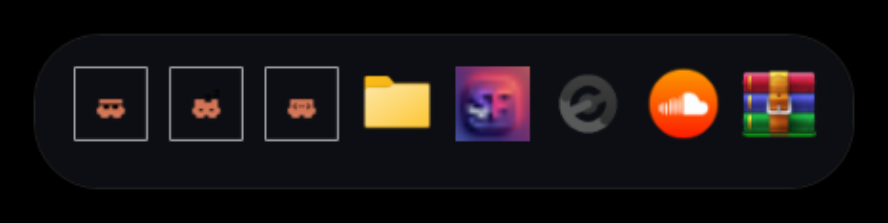<br /><sub><b>Obsidian</b><br />Near-black, barely-there edge</sub></td>
    <td align="center">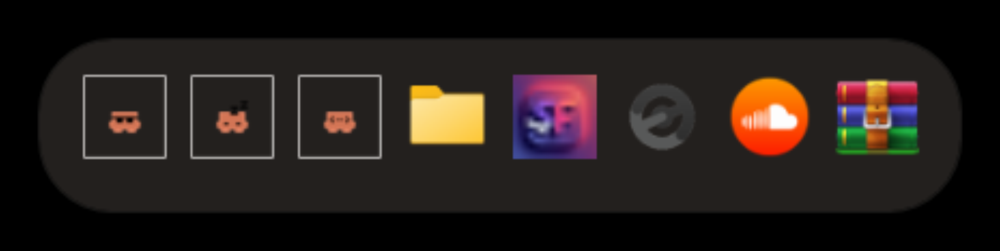<br /><sub><b>Graphite</b><br />Warm grey, soft and matte</sub></td>
    <td align="center">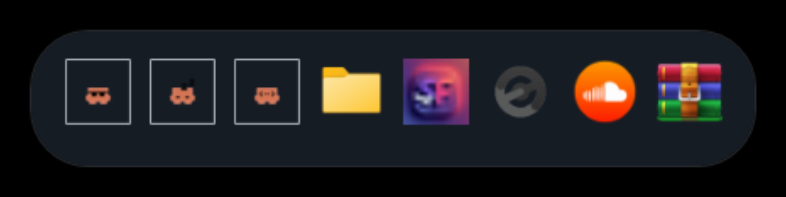<br /><sub><b>Frost</b><br />Pale glass, cool highlight</sub></td>
  </tr>
  <tr>
    <td align="center">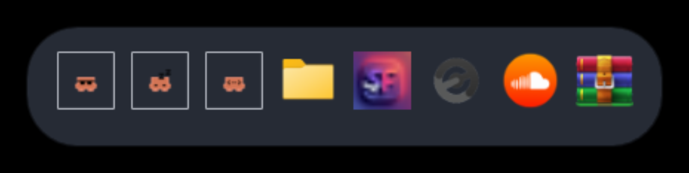<br /><sub><b>Nord</b><br />Polar night, muted blue</sub></td>
    <td align="center">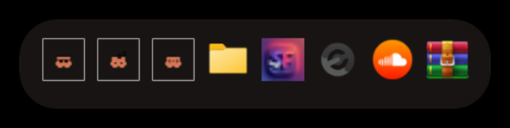<br /><sub><b>Dune</b><br />Warm sand on charcoal</sub></td>
    <td align="center"><br /><sub><b>Ink</b><br />Deep indigo, dusk violet</sub></td>
  </tr>
  <tr>
    <td align="center">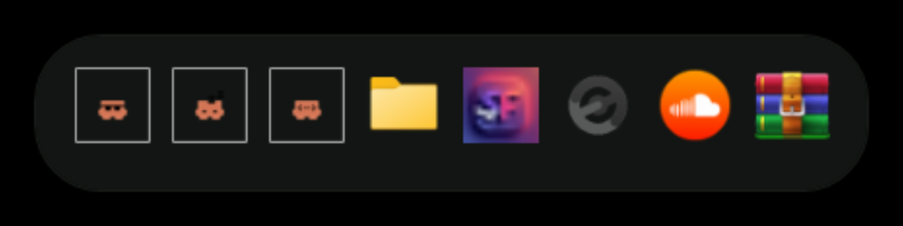<br /><sub><b>Moss</b><br />Forest grey, sage accent</sub></td>
    <td align="center">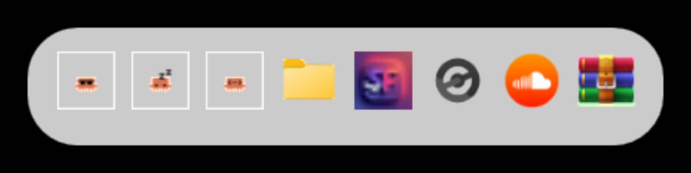<br /><sub><b>Porcelain</b><br />Light, for pale wallpapers</sub></td>
    <td align="center"><br /><sub><b>Custom</b><br />Whatever you make</sub></td>
  </tr>
</table>

They're deliberately quiet — a near-neutral slab and one restrained accent. A dock sits over your
wallpaper all day; it shouldn't compete with it.

---

## Settings

Right click the dock → **Settings…**. Every change applies to the live dock as you make it, and
there isn't a stock Windows control anywhere in it.

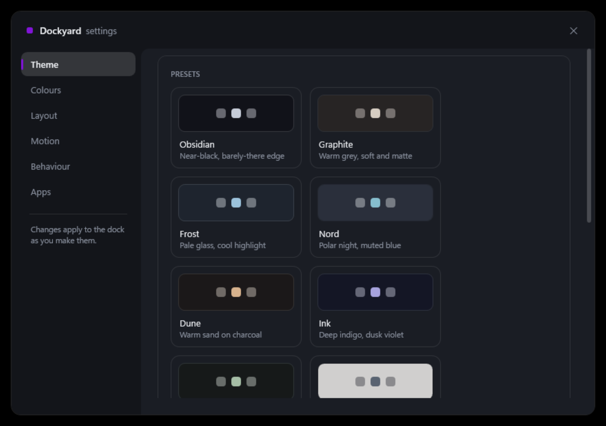

Each preset swatch is a miniature of the dock rather than a colour chip, so you can see what
you're picking before you pick it.

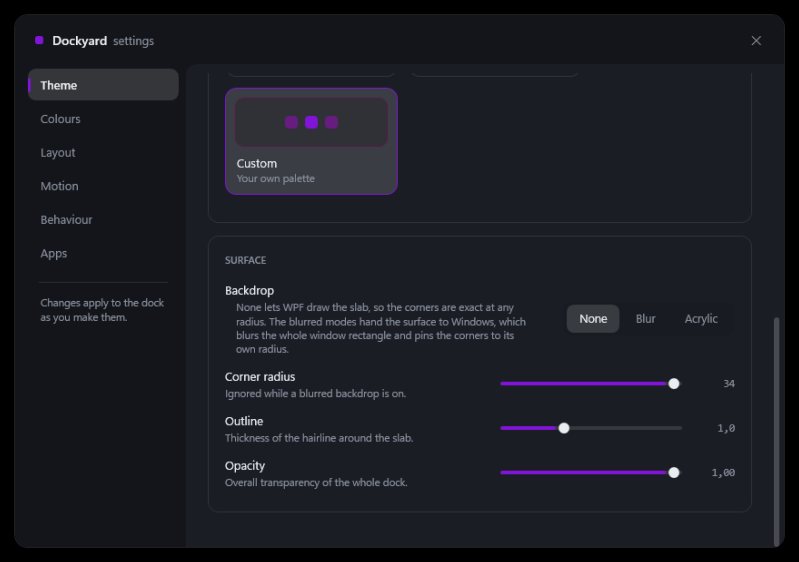

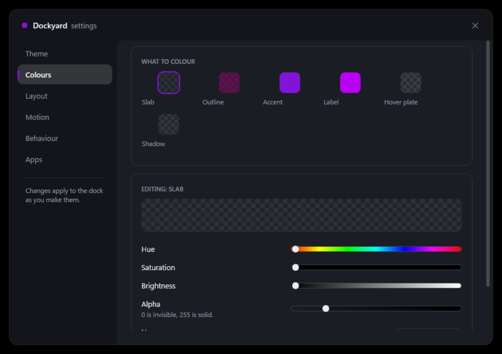

Six colour roles — slab, outline, accent, label, hover plate, shadow — each tunable by hue,
saturation, brightness and alpha, or by typing a hex value. Every track previews its own axis: the
saturation ramp shows that colour at every saturation, the alpha track fades over a checkerboard.

<table>
  <tr>
    <td>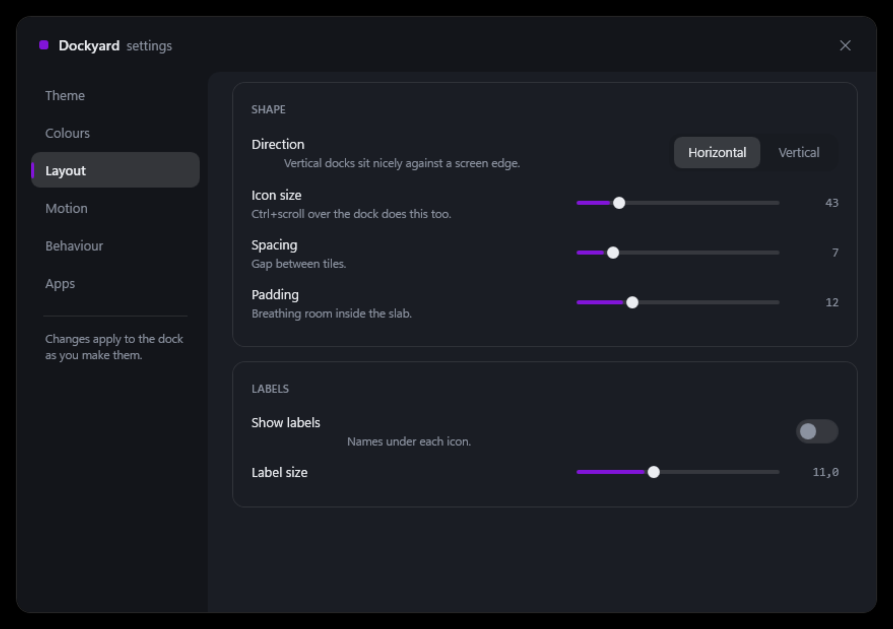</td>
    <td>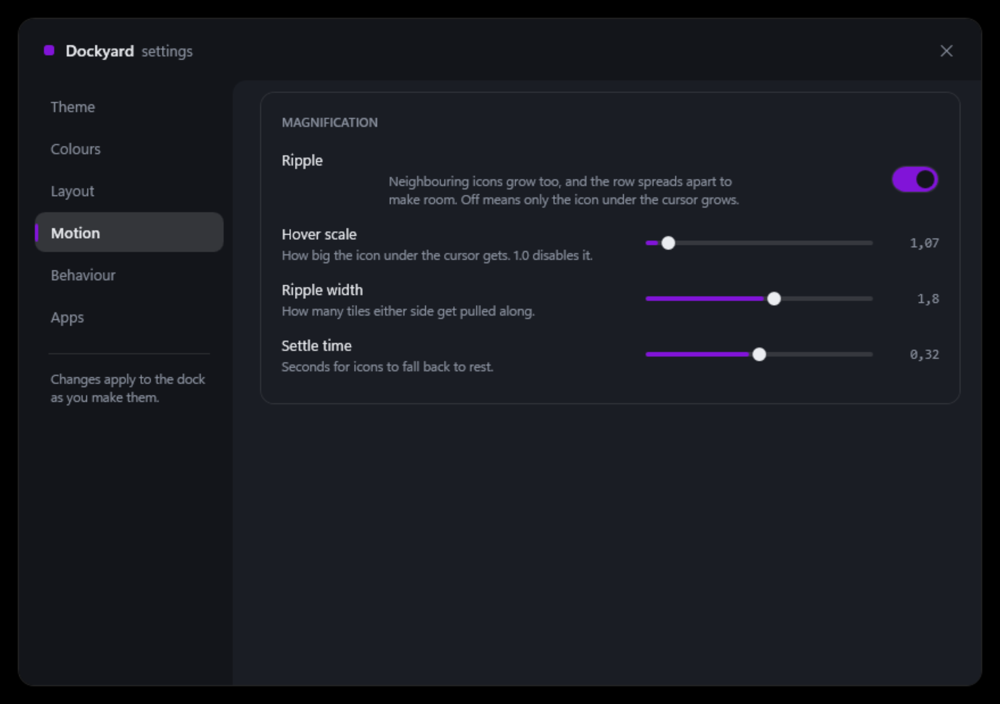</td>
  </tr>
  <tr>
    <td>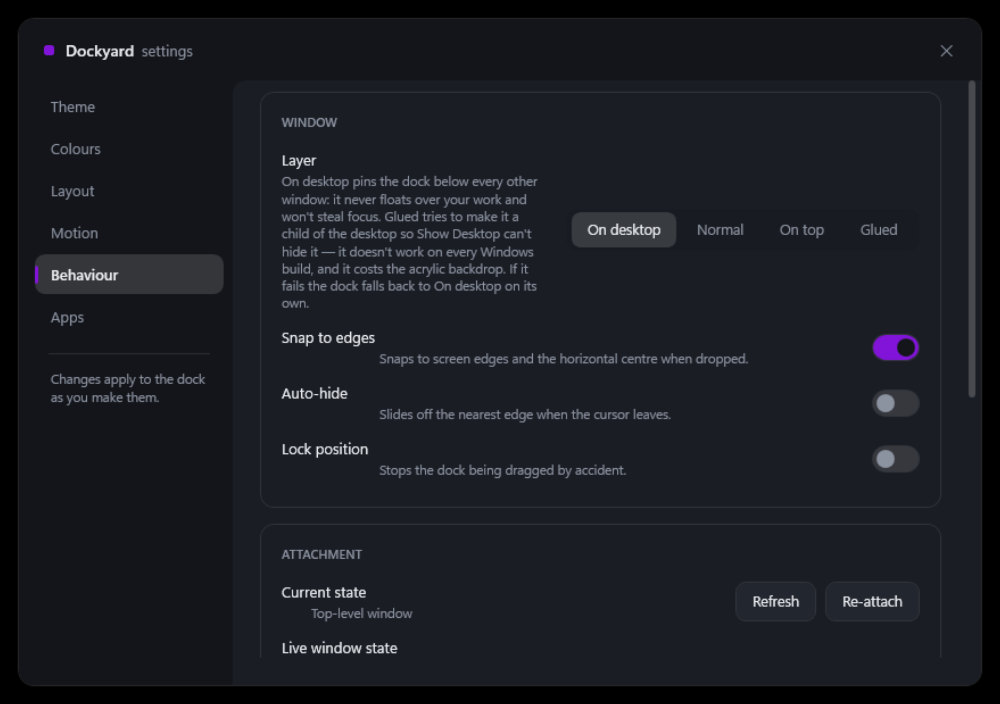</td>
    <td>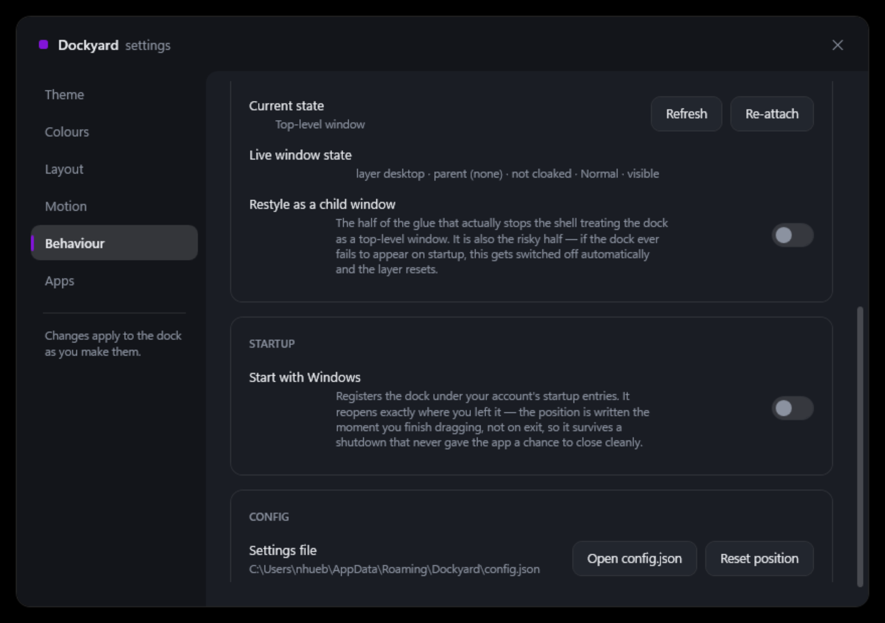</td>
  </tr>
</table>

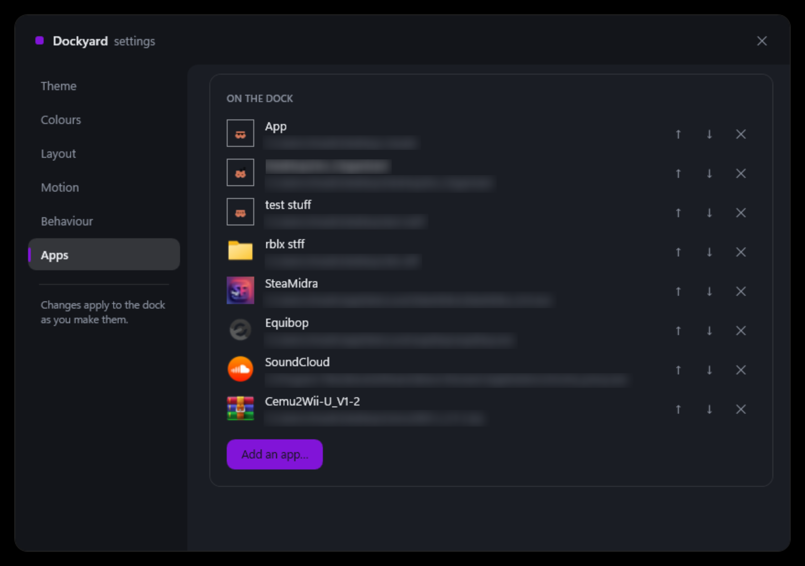

---

## Install

Two options on the [latest release](../../releases/latest) — take either:

- **`Dockyard.exe`** — portable. Download, run, done. Nothing installed, nothing left behind, and
  it happily lives on a USB stick.
- **`DockyardSetup.exe`** — installer. Adds a Start-menu entry and an uninstaller. Installs
  per-user, so no admin rights.

Then drag an app onto the dock.

To remove it later, `Uninstall-Dockyard.bat` is on the same release page. It handles either
install route, shows you what it found before touching anything, and keeps your settings unless
you tell it not to.

If the release says the exe is standalone, it needs nothing else at all. Otherwise it wants the
**.NET Desktop Runtime 8 or newer**, which most Windows machines already have — grab it from
[dotnet.microsoft.com/download](https://dotnet.microsoft.com/download/dotnet) if the dock doesn't
appear.

Settings live in `%APPDATA%\Dockyard\config.json`. Put a `config.json` next to the exe instead and
it runs portable — the whole thing works off a USB stick.

**Start with Windows:** Settings → Behaviour → *Start with Windows*. Per-user, no admin rights,
and it shows up in Task Manager's Startup tab like anything else.

---

## Using it

| Action | How |
|---|---|
| Add an app | Drag an `.exe`, shortcut, folder or file onto the dock |
| Add a website | Drag a URL from your browser's address bar onto the dock |
| Launch | Left click a tile |
| Reorder | Click and drag a tile sideways |
| Move the dock | Drag the empty slab — it snaps to screen edges and the centre |
| Resize icons | `Ctrl` + scroll over the dock |
| Tile options | Right click a tile — rename, change icon, arguments, run as admin, remove |
| Everything else | Right click the slab → Settings |

---

## Known limits

- **Show Desktop hides it.** That feature minimises every top-level window and the dock is one.
  There's an experimental *Glued* layer mode that tries to make the dock a child of the desktop to
  dodge this; it doesn't work on every Windows build, and it costs the acrylic backdrop.
- **Acrylic pins the corner radius.** The blurred backdrops hand the surface to Windows, which
  blurs the whole window rectangle and forces its own corner radius. The default `None` backdrop is
  drawn by the app, so corners are exact at any radius.

---

## Building it yourself

Needs the **.NET SDK 8 or newer**. No NuGet packages to restore — the project has zero
dependencies beyond the framework itself.

```bash
git clone https://github.com/ZenCodeOrSomeShit/dockyard
cd dockyard/src
dotnet run
```

For a release build, one standalone file with the runtime bundled in:

```bash
dotnet publish Dockyard.csproj -c Release -r win-x64 --self-contained true ^
  -p:PublishSingleFile=true -p:IncludeNativeLibrariesForSelfExtract=true ^
  -p:EnableCompressionInSingleFile=true -o out
```

Or a small one that uses the .NET runtime already on the machine:

```bash
dotnet publish Dockyard.csproj -c Release -r win-x64 --self-contained false ^
  -p:PublishSingleFile=true -o out
```

> **If you get `NU1100`,** the project is targeting a .NET band you don't have installed and NuGet
> is trying to download its targeting packs. Add `-p:TargetFramework=netX.0-windows` matching your
> SDK — check with `dotnet --version`.

`installer/Dockyard.iss` builds the installer with [Inno Setup](https://jrsoftware.org/isinfo.php)
once `out/Dockyard.exe` exists.

### Layout

```
src/
  App.xaml(.cs)             single-instance guard, respawn, context-menu styling
  MainWindow.xaml(.cs)      the dock — magnification, drag, drop, z-order
  SettingsWindow.xaml(.cs)  settings UI; panes are built in code
  PromptWindow.cs           small themed text prompt (WPF ships no InputBox)
  Themes/Controls.xaml      hand-templated sliders, switches, segments, fields
  Models/                   DockConfig, DockItem
  Services/
    ConfigService.cs        JSON load/save, theme presets, migration, crash guard
    ColorUtil.cs            hex / RGB / HSV conversion and the slider ramps
    StartupService.cs       the per-user launch-at-login registry entry
  Interop/
    Native.cs               acrylic, monitor geometry, z-order, desktop reparenting
    IconExtractor.cs        256px shell icons via IShellItemImageFactory
    ShortcutResolver.cs     .lnk and .url parsing via IShellLinkW
```

Most of the interesting problems live in `Interop/` and in the z-order handling in
`MainWindow.xaml.cs` — the comments there explain why things are done the way they are rather than
the obvious way, which is usually because the obvious way doesn't work.

---

Built with WPF on .NET. No NuGet packages — just the framework and a fair amount of Win32.

Written by [ZenCodeOrSomeShit](https://github.com/ZenCodeOrSomeShit), pair-programmed with
[Claude](https://claude.ai).

MIT licensed — see [LICENSE](LICENSE).
